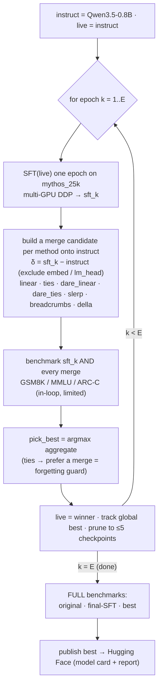

<div align="center">

# 🧪 Reasoning Distillation into Qwen3.5-0.8B

### Merge-corrected iterative SFT - distill a teacher's reasoning into a small model *without* forgetting.

*Each epoch: SFT one epoch, then check whether merging back toward the instruct model beats plain SFT on
benchmarks - and keep the winner. Merging used as a per-epoch correction against catastrophic forgetting.*

[](https://huggingface.co/Amine-CV/Qwen3.5-0.8B-Mythos-Distill)
[](https://huggingface.co/datasets/WithinUsAI/claude_mythos_distilled_25k)


</div>

---

## TL;DR

Distill [`WithinUsAI/claude_mythos_distilled_25k`](https://huggingface.co/datasets/WithinUsAI/claude_mythos_distilled_25k)
reasoning data into **Qwen3.5-0.8B**, and **measure whether merging helps** - rigorously (controls, full
eval, error bars, significance). The merge checkpoint lifts **GSM8K +3.7 pts (~2σ)** while **retaining
MMLU**; aggregate gains are reported honestly as within noise on a single run. The recipe, methodology,
and tooling are generalized into a reusable plugin: **[llm-tuning-lab](../llm-tuning-lab)**.

## 💡 The idea

```
instruct = Qwen/Qwen3.5-0.8B ;  live = instruct
for epoch k in 1..E:
    sft_k   = SFT(live, mythos_25k, 1 epoch)
    merge_k = instruct + α·(sft_k − instruct)        # model soup back toward instruct, excl. embed/lm_head
    score sft_k and merge_k on GSM8K / MMLU / ARC-Challenge
    live    = merge_k if score(merge_k) >= score(sft_k) else sft_k     # "recorrect" vs "continue"
final: FULL benchmarks on the original instruct, final-SFT, and the best checkpoint
```



The deliverable is the **SFT vs SFT+merge** comparison per epoch, plus a final table against the original
**instruct** baseline. Everything is tracked in **MLflow** and the chosen checkpoint is published to the Hub.

## 📈 Results

Full write-up with error bars, significance, and threats-to-validity: [`results/REPORT.md`](results/REPORT.md).

**Per-epoch: SFT vs 7 merge methods.** Merges win at epoch 1 (TIES best) right after the instruct->SFT
shift; once stabilized, plain SFT overtakes - so *when* you merge matters more than *which* method.

<div align="center"></div>

**Training dynamics.** SFT loss collapses to ~0.02 (~99% token accuracy) - heavy memorization of the
templated data, which is exactly what the merge correction guards against.

<div align="center"></div>

| model (full eval, ±1 SE) | GSM8K | MMLU | ARC-C |
|---|---|---|---|
| original Qwen3.5-0.8B | 0.326 ±0.013 | 0.481 ±0.004 | 0.375 ±0.014 |
| **SFT + merge** (published) | **0.363 ±0.013** | 0.481 ±0.004 | 0.370 ±0.014 |

Regenerate the figures with `python scripts/make_figures.py`.

## 🤗 Use the model

```python
from transformers import AutoModelForCausalLM, AutoTokenizer
tok = AutoTokenizer.from_pretrained("Amine-CV/Qwen3.5-0.8B-Mythos-Distill")
model = AutoModelForCausalLM.from_pretrained("Amine-CV/Qwen3.5-0.8B-Mythos-Distill",
                                             dtype="bfloat16", device_map="auto")
msgs = [{"role": "user", "content": "Prove there are infinitely many primes."}]
ids = tok.apply_chat_template(msgs, add_generation_prompt=True, return_tensors="pt").to(model.device)
print(tok.decode(model.generate(ids, max_new_tokens=512)[0][ids.shape[1]:], skip_special_tokens=True))
```

## ⚙️ Setup

```bash
conda activate dist_train          # python 3.12 + uv
uv pip install -r requirements.txt # torch, transformers, trl, lm-eval, mlflow, ...
uv pip install --group dev         # pytest
python -m pytest                   # offline unit tests
```

## ▶️ Run

```bash
# smoke (cheap end-to-end): 1 epoch, ~200 examples, in-loop bench limit 20
MLFLOW_TRACKING_URI=http://localhost:5000 python train_distill.py --config configs/sft.yaml \
  --set num_epochs=1 max_samples=200 eval_limit=20

# full recipe (E=3, 25k; SFT on both GPUs, bench on cuda:1)
MLFLOW_TRACKING_URI=http://localhost:5000 python train_distill.py --config configs/sft.yaml

# full benchmark eval of any checkpoint(s)
CUDA_VISIBLE_DEVICES=1 python -m distill.eval_bench --models Qwen/Qwen3.5-0.8B outputs/distill/epoch3/merge

# publish the chosen checkpoint with model card + results
python publish_hub.py --model_dir outputs/distill/epoch3/merge --repo Amine-CV/Qwen3.5-0.8B-Mythos-Distill
```

GPUs: SFT runs on both (`CUDA_VISIBLE_DEVICES=0,1` + `configs/accelerate_multi.yaml`); merge/eval pin to
`cuda:1` (cuda:0 is shared). MLflow server expected at `http://localhost:5000`.

## 📂 Layout

```text
├── train_distill.py       # orchestrator: per-epoch SFT -> merge -> bench -> decide -> MLflow
├── sft_worker.py          # one SFT epoch (TRL SFTTrainer; launched via accelerate, multi-GPU)
├── publish_hub.py         # push chosen checkpoint + model card + results to the Hub
├── distill/
│   ├── config.py          # SFTMergeConfig + YAML/CLI override resolution (type-coerced)
│   ├── data.py            # dataset loading + chat rendering for SFT
│   ├── merge.py           # 7 pure-PyTorch merge methods (core + I/O wrapper)
│   ├── recipe.py          # the merge-vs-continue decision policy
│   ├── eval_bench.py      # lm-evaluation-harness wrapper (GSM8K / MMLU / ARC-Challenge)
│   ├── tracking.py        # best-effort MLflow logging
│   └── utils.py
├── configs/               # sft.yaml + accelerate (single / 2-GPU DDP)
├── results/               # REPORT.md, benchmark tables, confirm_stderr.json, figures/
└── tests/                 # offline pure-unit tests (pytest)
```

## 📜 License

Pipeline code: MIT. Training data `WithinUsAI/claude_mythos_distilled_25k` is Apache-2.0; the Qwen3.5
weights follow their own license. Built with Hugging Face Transformers, TRL, Accelerate, Datasets, PEFT,
lm-evaluation-harness, and MLflow.
