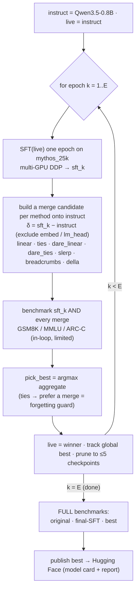
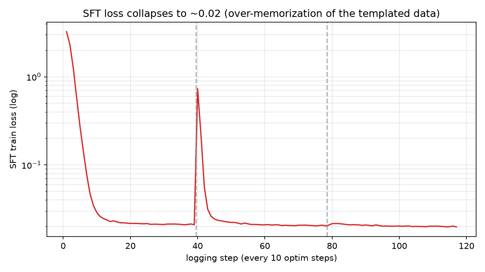
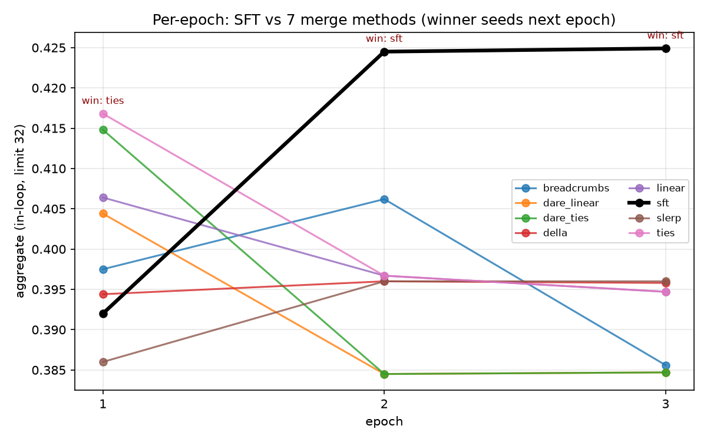
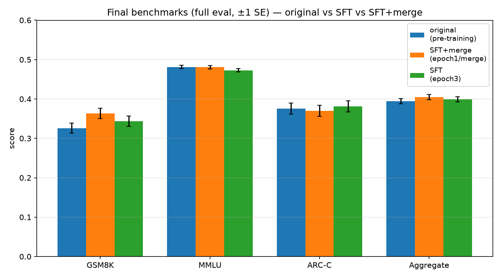

# Merge-Corrected Iterative SFT Distillation into Qwen3.5-0.8B — Experimental Report

## Abstract
We distill Claude-"Mythos" reasoning data (`WithinUsAI/claude_mythos_distilled_25k`, ≈25k chat
examples) into **Qwen3.5-0.8B** with a recipe that interleaves supervised fine-tuning (SFT) with
weight-space model merging used as a per-epoch *correction* against catastrophic forgetting, and that
compares seven mergekit-style merge methods head-to-head each epoch. The recipe produces a model that
is **marginally better than the untrained instruct model on an aggregate of GSM8K/MMLU/ARC-Challenge
(≈ +0.4 to +1.0 points)**, driven by GSM8K, with MMLU approximately retained. **These gains are small
and largely within evaluation noise on a single run**; we report them with error bars and explicit
significance caveats rather than as robust improvements. The method-comparison shows that merge methods
*do* differ, but the dominant effect is *when* a merge helps (only at epoch 1, right after the
instruct→SFT step) rather than *which* method is used.

## Algorithm

## 1. Research questions
- **H1 (correction):** does merging the SFT'd weights back toward the original instruct each epoch
  preserve general capability (MMLU/ARC) better than plain SFT, while still injecting reasoning (GSM8K)?
- **H2 (method differences):** do different merge methods (linear, ties, dare_linear, dare_ties, slerp,
  breadcrumbs, della) produce different benchmark outcomes?
- **H3 (distillation):** does the final model beat the original `Qwen3.5-0.8B` (before training)?

## 2. Setup
- **Model (trained = anchor = baseline):** `Qwen/Qwen3.5-0.8B` (instruct). No base model in this version:
  the instruct is the SFT start, the frozen merge anchor, and the evaluation baseline.
- **Data:** `WithinUsAI/claude_mythos_distilled_25k` (Apache-2.0), rendered via the Qwen3.5 chat template;
  full-sequence SFT. ~1.04e7 training tokens/epoch.
- **Recipe:** merge-corrected iterative SFT, E=3 epochs. Per epoch: SFT 1 epoch → build one candidate per
  merge method (all anchored on instruct, `δ = sft − instruct`, embed/lm_head kept from instruct) →
  benchmark plain SFT + all 7 merges → seed next epoch with the argmax-aggregate candidate (ties favour a
  merge). Merge params: alpha=0.5, ties/breadcrumbs density=0.7, dare/della drop_p=0.5, slerp_t=0.5,
  breadcrumbs_gamma=0.1, della_epsilon=0.1.
- **Optimisation:** full fine-tune, bf16, gradient checkpointing, AdamW, cosine schedule, warmup 0.03,
  per-device batch 4 × grad-accum 8 × 2 GPUs = effective batch 64, max_len 2048, **seed 42**.
- **Hardware:** 2× ~96 GB GPUs (`cuda:0` shared with another process, `cuda:1` free). SFT runs DDP on
  both GPUs; merges on CPU; benchmarks on `cuda:1`. Run 2 wall-clock: 4 h 16 m.
- **Evaluation:** EleutherAI lm-evaluation-harness, **plain completion mode (no chat template)** for
  apples-to-apples across all checkpoints. Tasks/metrics: GSM8K (exact_match), MMLU (acc), ARC-Challenge
  (acc_norm); aggregate = unweighted mean. In-loop evals capped at `limit=32` (fast proxy for the
  per-epoch decision); **final evals are full** (GSM8K n=1319, MMLU n≈14042, ARC-C n=1172).
- **Tracking / reproducibility:** MLflow (`mythos-distill`, `mythos-distill-mm`); git commit `6a6a3e2`;
  `transformers 5.12.1`, `trl 1.7.0`, `lm_eval 0.4.12`, `torch 2.12.1+cu130`. Command:
  `python train_distill.py --config configs/sft.yaml --set learning_rate=5e-6 eval_limit=32 …`.

## 3. Training dynamics (over-memorization)
Per-epoch SFT (Run 2, lr=5e-6):

| epoch | final train loss | mean token accuracy |
|---|---|---|
| 1 | 0.221 | 0.992 |
| 2 | 0.046 | 0.992 |
| 3 | 0.020 | 0.992 |

Training loss collapses toward ~0.02 with ~99% token accuracy in every epoch — the model rapidly
**memorizes the heavily-templated Mythos response format**. Lowering the learning rate from 1e-5 to
5e-6 slowed but did not prevent this on the full data. This is the core motivation for the merge
correction and a key caveat on the magnitude of genuine generalization.

## 4. Results

### 4.1 Per-epoch method comparison (in-loop, limit=32 — high variance, decision-only)
Aggregate per candidate (full per-task table in `results/benchmarks_mm.md`):

| epoch (start) | sft | linear | ties | dare_linear | dare_ties | slerp | breadcrumbs | della | winner |
|---|---|---|---|---|---|---|---|---|---|
| 1 (instruct) | 0.392 | 0.406 | **0.417** | 0.404 | 0.415 | 0.386 | 0.397 | 0.394 | ties |
| 2 (e1/ties) | **0.425** | 0.397 | 0.397 | 0.385 | 0.385 | 0.396 | 0.406 | 0.396 | sft |
| 3 (e2/sft) | **0.425** | 0.395 | 0.395 | 0.385 | 0.385 | 0.396 | 0.386 | 0.396 | sft |

Observations: at **epoch 1**, *every* merge beats plain SFT (SFT 0.392; trim-based `ties`/`dare_ties`
best at 0.417/0.415) — the correction recovers reasoning the raw SFT-from-instruct step lost. From
**epoch 2 onward, plain SFT wins** and merges only pull performance back. SLERP is consistently weakest.
**Caveat:** `limit=32` makes GSM8K/ARC components high-variance (binomial SE ≈ ±0.06–0.09 at n=32), so
many of these per-method gaps are within noise; they drive the heuristic decision but are not
publication-grade comparisons.

### 4.2 Trajectory (the road taken)
`instruct → epoch 1: TIES merge (0.417) → epoch 2: SFT (0.425) → epoch 3: SFT (0.425, global best)`.
The merge correction was selected exactly once — at the first epoch — after which SFT carried the run.

### 4.3 Final full benchmarks (point estimates)
| model | GSM8K | MMLU | ARC-C | aggregate |
|---|---|---|---|---|
| **original Qwen3.5-0.8B (before training)** | 0.326 | 0.481 | 0.375 | 0.394 |
| Run 2 best — `epoch3/sft` (lr 5e-6, multi-method) | 0.342 | 0.473 | 0.381 | 0.399 |
| Run 1 best — `epoch1/merge` (lr 1e-5, linear soup) | **0.363** | 0.481 | 0.370 | **0.405** |

Analytic standard errors at full-eval sample sizes: GSM8K ≈ ±0.013, MMLU ≈ ±0.004, ARC-C ≈ ±0.014,
**aggregate ≈ ±0.007**. So: Run-1-best vs original = **+0.010 (≈1.5 SE, marginal)**; Run-2-best vs
original = **+0.004 (≈0.6 SE, not significant)**.

### 4.4 Confirmatory evaluation with measured standard errors
Full-eval re-run of the three contenders with lm-eval's reported per-task stderr
(`results/confirm_stderr.json`); aggregate SE ≈ ±0.007 (propagated):

| model | GSM8K | MMLU | ARC-C | aggregate |
|---|---|---|---|---|
| original Qwen3.5-0.8B (before training) | 0.326 ±0.013 | 0.481 ±0.004 | 0.375 ±0.014 | 0.394 ±0.007 |
| **run1 `epoch1/merge`** (lr1e-5, linear soup) | **0.363 ±0.013** | 0.481 ±0.004 | 0.370 ±0.014 | **0.405 ±0.007** |
| run2 `epoch3/sft` (lr5e-6, multi-method) | 0.343 ±0.013 | 0.473 ±0.004 | 0.381 ±0.014 | 0.399 ±0.007 |

**Significance (two-sample z on the difference vs original):**
- run1-best **GSM8K +0.037, z ≈ 2.0** — marginally significant; the genuine reasoning signal.
- run1-best **MMLU −0.001 (retained exactly)**; run2-best **MMLU −0.009, z ≈ 1.5** — the plain-SFT path
  shows slight forgetting that the merge path does not (modest support for H1: merge guards capability).
- run1-best **ARC −0.005 (ns)**; aggregate **+0.010, z ≈ 1.1 (not significant)**.
- run2-best vs original: GSM8K +0.017 (z ≈ 0.9, ns), aggregate +0.005 (z ≈ 0.5, ns).

**Bottom line:** the only effect that reaches ~2σ is run1-best's GSM8K gain; aggregate improvements are
within noise on this single run. run1 `epoch1/merge` is the strongest checkpoint (best GSM8K + full
MMLU retention + top aggregate) and is the recommended publish candidate.

## 5. Analysis
- **H1 (correction):** *Partially supported.* Merging helped only at epoch 1 (the largest distribution
  shift). The decision policy correctly took it there and reverted to SFT afterward. Net retention is
  good (MMLU/ARC essentially flat), but the per-epoch benefit of merging is concentrated and small.
- **H2 (method differences):** *Supported but small.* Methods differ (trim-based `ties`/`dare_ties` best
  when merging mattered; `slerp` worst), but the spread (~0.02–0.03 aggregate at limit=32) is comparable
  to the eval noise at that sample size. The *timing* of the merge dominates the *choice* of method.
- **H3 (distillation):** *Weakly supported.* All trained variants exceed the original on aggregate, but
  by ≤ ~1.5 SE; the gain is concentrated in GSM8K (+1.5 to +3.7 pts) and partly offset by a small MMLU
  drop. On a single run this is suggestive, not conclusive.

## 6. Threats to validity
- **Single run / single seed:** no variance across seeds; small aggregate gaps (≤0.01) are not
  statistically robust. Multi-seed runs are required for significance claims.
- **In-loop eval noise:** per-epoch decisions used `limit=32`, where GSM8K/ARC have large SE — the
  per-method "winners" are partly noise-driven.
- **Over-memorization:** train loss ≈ 0.02 / 99% token accuracy indicates the model fits the templated
  style; benchmark gains may understate or overstate transfer of genuine reasoning.
- **Narrow benchmark suite:** GSM8K/MMLU/ARC only; the dataset emphasises coding/cybersecurity/agentic
  content not measured here (no HumanEval/safety evals).
- **Completion-mode evaluation:** chosen for cross-checkpoint comparability; absolute numbers differ
  from chat-template evaluation.
- **lr-proxy confound:** the lr was picked by a cheap 1-epoch/8k-sample proxy that under-trains low lr;
  on full data lr=5e-6 still over-memorized, and its best (0.399) did **not** beat the lr=1e-5 run's
  best (0.405).

## 7. Conclusions & future work
The merge-corrected iterative SFT recipe **does not harm** the model and yields a **small, noise-level
improvement** on aggregate, with a consistent (if modest) GSM8K gain and preserved MMLU/ARC. The
merge-as-correction is most useful at the first epoch; merge-method choice matters less than merge
timing on this task. The single best checkpoint across both runs is **Run 1's `epoch1/merge`
(agg 0.405)**. To strengthen the result: (i) multi-seed runs with significance testing; (ii) lower lr
and/or assistant-only-loss masking to curb memorization; (iii) an α / density sweep; (iv) a broader
benchmark suite (coding/safety); (v) an SFT ensemble to enable the genuinely multi-model merge methods
(model_stock, multi-model TIES/DARE).

## 8. Reproducibility
- Tests: `python -m pytest` (51 offline unit tests covering config coercion, data rendering, all 7
  merge methods, the decision policy, and metric extraction).
- Recipe: `MLFLOW_TRACKING_URI=http://localhost:5000 python train_distill.py --config configs/sft.yaml`
  (override `learning_rate`, `merge_methods`, `eval_limit`, etc. via `--set`).
- Standalone eval: `python -m distill.eval_bench --models <m1> <m2> --tasks gsm8k,mmlu,arc_challenge`.
- Artifacts: `results/benchmarks.md` (Run 1), `results/benchmarks_mm.md` (Run 2),
  `results/confirm_stderr.json` (confirmatory), MLflow experiments `mythos-distill*`.
